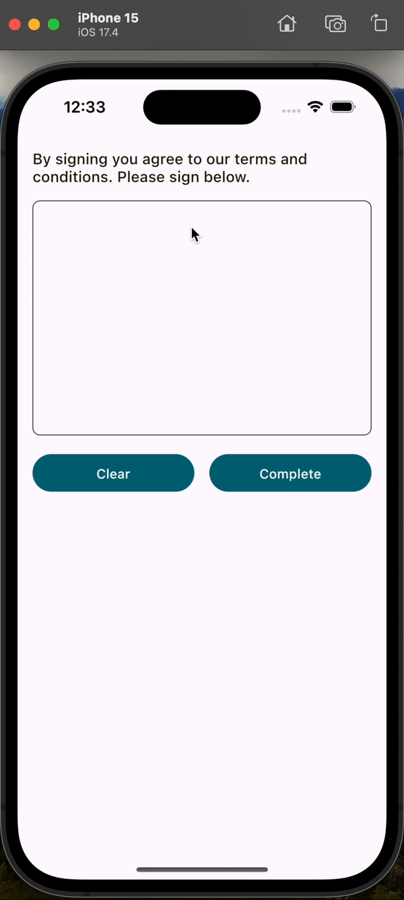
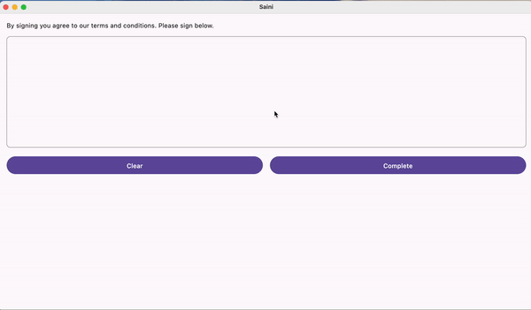

[](https://search.maven.org/artifact/io.github.joelkanyi/sain)


[](https://opensource.org/licenses/Apache-2.0)

# Sain (サイン)

A Compose Multiplatform library for capturing and exporting signatures as `ImageBitmap` with customizable options. Perfect for electronic signatures, legal documents, and more.

**Supported platforms:** Android · iOS · Desktop (JVM) · Web (JS) · Web (WasmJS)

See the [project's website](https://joelkanyi.github.io/sain/) for full documentation.

## Features

- Capture signatures as `ImageBitmap` on all platforms
- Customizable signature color, thickness, pad color, shape, and border
- Optional guideline with configurable style, padding, and dash pattern
- Hint text when the signature pad is empty
- State management with `rememberSignatureState()` for persistence
- Clear and complete actions via `SignatureAction`

## Installation

Add the Maven Central repository if it is not already there:

```kotlin
repositories {
    mavenCentral()
}
```

### Multiplatform Projects

Add the dependency to your `commonMain` source set:

```kotlin
kotlin {
    sourceSets {
        commonMain {
            dependencies {
                implementation("io.github.joelkanyi:sain:<latest-version>")
            }
        }
    }
}
```

### Android Projects

Add the dependency to your app's `build.gradle.kts`:

```kotlin
dependencies {
    implementation("io.github.joelkanyi:sain:<latest-version>")
}
```

### Gradle Version Catalog

Add the following to your `libs.versions.toml`:

```toml
[versions]
sain = "<latest-version>"

[libraries]
sain = { module = "io.github.joelkanyi:sain", version.ref = "sain" }
```

Then add the dependency in your `build.gradle.kts`:

```kotlin
dependencies {
    implementation(libs.sain)
}
```

## Quick Start

Add the `Sain` composable to your project:

```kotlin
var imageBitmap by remember { mutableStateOf<ImageBitmap?>(null) }

Sain(
    signatureHeight = 250.dp,
    signaturePadColor = Color.White,
    signatureBorderStroke = BorderStroke(
        width = .5.dp,
        color = MaterialTheme.colorScheme.onSurface,
    ),
    signaturePadShape = RoundedCornerShape(8.dp),
    onComplete = { signatureBitmap ->
        if (signatureBitmap != null) {
            imageBitmap = signatureBitmap
        } else {
            println("Signature is empty")
        }
    },
) { action ->
    Row(
        modifier = Modifier
            .padding(top = 16.dp)
            .fillMaxWidth(),
        horizontalArrangement = Arrangement.spacedBy(16.dp),
    ) {
        Button(
            modifier = Modifier.weight(1f),
            onClick = {
                imageBitmap = null
                action(SignatureAction.CLEAR)
            },
        ) {
            Text("Clear")
        }
        Button(
            modifier = Modifier.weight(1f),
            onClick = {
                action(SignatureAction.COMPLETE)
            },
        ) {
            Text("Complete")
        }
    }
}
```

## Preview

| Android | iOS | Desktop |
|:-------:|:---:|:-------:|
|  |  |  |

| Web (JS) | Web (WasmJS) |
|:--------:|:------------:|
|  |  |

## License

```
Copyright 2023 Joel Kanyi

Licensed under the Apache License, Version 2.0 (the "License");
you may not use this file except in compliance with the License.
You may obtain a copy of the License at

   http://www.apache.org/licenses/LICENSE-2.0

Unless required by applicable law or agreed to in writing, software
distributed under the License is distributed on an "AS IS" BASIS,
WITHOUT WARRANTIES OR CONDITIONS OF ANY KIND, either express or implied.
See the License for the specific language governing permissions and
limitations under the License.
```
